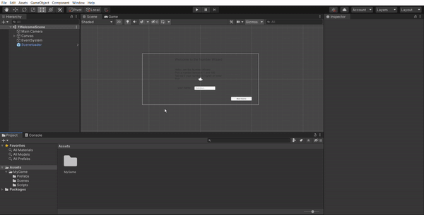

# Template2D-Unity202015f1

### Project description: 
Wizard Game, is a guessing Game with Numbers
### Development platform: 
(Windows 10, Unity 2020.1.5f1, Visual Studio 2019)

### Target platform: 
WebGL, Mobile, VR Device incl. reference resolution 

### Visuals: 

### Necessary setup/execution steps: 
Installation process, e.g. step by step instructions that I can run the project after cloning it

### Third party material: 
(if used Fonts, Sounds, Music, Graphics, Materials, Code etc.)

### Project state: 
95%

### Limitations: 

### Lessons Learned: 

Copyright by Stefanie Zwingenberger
